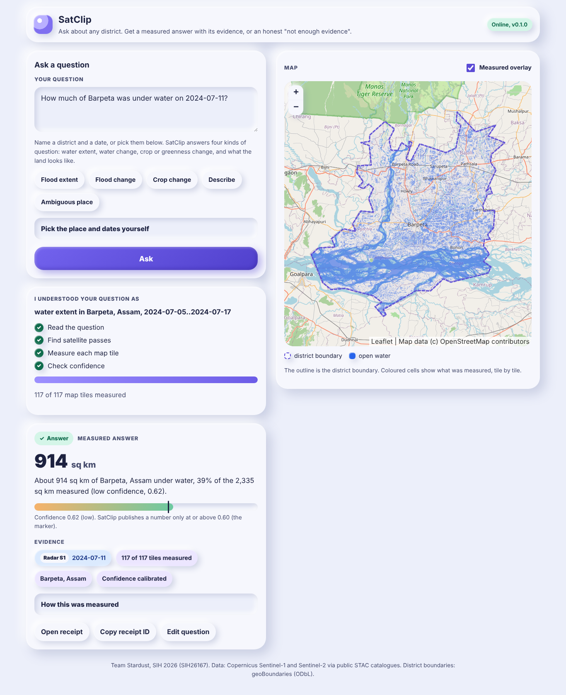

# SatClip

**Ask a plain question about any place in India and two dates. Get back an answer you can check.**

SatClip is Team Stardust's Smart India Hackathon 2026 project for problem statement **SIH26167**: "SatQueryAI: an interactive vision-language assistant for multimodal remote sensing image analysis through text queries".

You might ask: *"Was Barpeta flooded after 2 July compared to mid June?"* SatClip finds the right Sentinel-1 radar or Sentinel-2 optical scenes for that area through public STAC catalogues. If clouds block the optical view, it switches to radar on its own. Then it measures the change with a transparent instrument and returns an **evidence card**. The card holds:

- the measured answer and a map mask;
- the scene IDs and acquisition dates;
- a confidence score, fitted on hand-labelled flood maps for water (Sen1Floods11) and labelled as a placeholder where no fit exists yet;
- a receipt that re-runs the same analysis.

When the evidence is not good enough, it says "insufficient evidence" and tells you when the next useful satellite pass is.



More screens (mobile, dark mode, abstention, ambiguous district): [docs/screenshots/](docs/screenshots/).

## Run it

```bash
# no Docker, in-process queue
cd backend && pip install -e ".[dev]" && uvicorn satclip.api.main:app --reload
# open http://localhost:8000 ; tests: python -m pytest -q

# full stack with Redis and scalable workers
docker compose up --build        # UI on http://localhost:8080, API on :8000
docker compose up --scale worker=8
```

Try a question in the UI, or run real questions end to end against the live catalogues:

```bash
cd backend && python -m satclip.livecheck "How much of Barpeta was under water on 2024-07-11?"
# About 905 sq km of Barpeta, Assam under water, 39% of the 2,335 sq km measured (low confidence, 0.62).
# 117 tiles, about 40 s on a CPU. History: run 5 published 681 sq km at an uncalibrated 0.66; the run 6
# Sen1Floods11 fit showed that was overconfident (abstained at 0.46); run 7 added VH to the water
# instrument and refitted, so the card answers again with a fitted confidence.
```

The optional land-cover instrument needs `pip install -e ".[ml]"` (CPU torch and open_clip); without it, land-cover questions abstain with a clear reason.

## Who it is for

The people who must answer "where and how bad" questions without GIS skills:

- district disaster officials;
- agriculture and crop-insurance officers;
- journalists and fact-checkers;
- planners.

See [SOLUTION.md](SOLUTION.md) for the full thesis and evidence.

## Project map

| Part | Where | Status |
|---|---|---|
| Solution thesis | [SOLUTION.md](SOLUTION.md) | v1.6 (run 7) |
| Novelty analysis | [NOVELTY.md](NOVELTY.md) | v7 (run 7) |
| Research archive (target about 200 papers) | [archive/](archive/README.md) | 175 papers |
| Problem evidence brief | [docs/reference/problem-evidence.md](docs/reference/problem-evidence.md) | v1 |
| Idea deck summary | [docs/reference/deck-notes.md](docs/reference/deck-notes.md) | done |
| Architecture | [docs/ARCHITECTURE.md](docs/ARCHITECTURE.md) | M1 to M5 done (section 6.9 for training) |
| Prototype (FastAPI backend and claymorphism frontend) | [backend/](backend/), [frontend/](frontend/), [config/satclip.yaml](config/satclip.yaml), [docker-compose.yml](docker-compose.yml) | Working end to end on live Sentinel data: data layer (M2), five instruments with confidence, abstention and map overlays (M3); mobile-first claymorphism UI with district picker, two-date compare, evidence chips, confidence meter and map overlays (M4) |
| Training code (LoRA, Colab notebook, evaluation, calibration) | [training/](training/README.md) | M5 done (run 7): water extent calibrated on Sen1Floods11 (v1.1, VV or VH), water change on Kuro Siwo; LoRA pipeline, Colab notebook, Indian Q&A builder (WorldCover labels) and evaluation harness with measured baselines, including a hand-written intent test set |
| Pitch deck (.pptx) | `deck/` | M7, planned |
| Plan and progress | [PLAN.md](PLAN.md), [STATE.md](STATE.md) | live |

## Team Stardust (RVITM)

- Sai Bhuwan S
- Yashita Mandavilli
- Raj Venkat
- Nikhil S Rao
- Shashwat Mittal
- Sasanuru Anirudh

## Licence

BSD 2-Clause. See [LICENSE](LICENSE).
