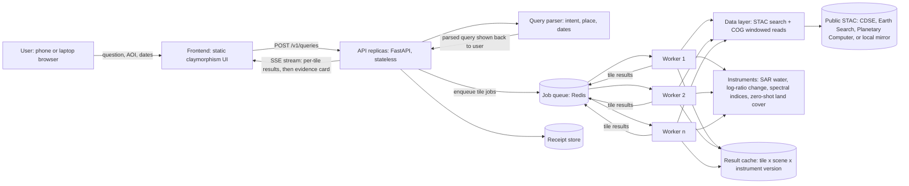
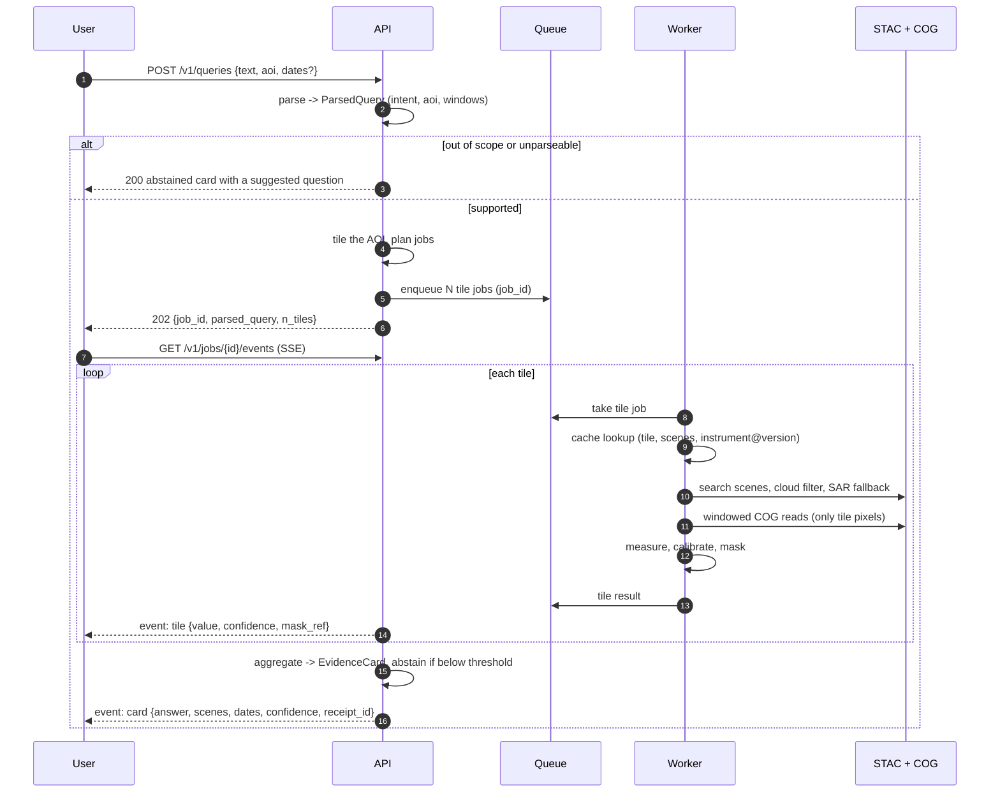
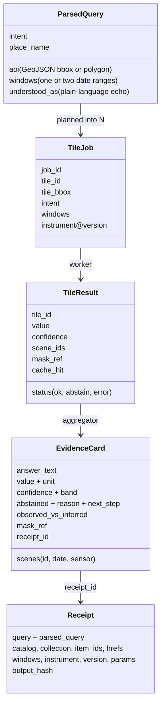
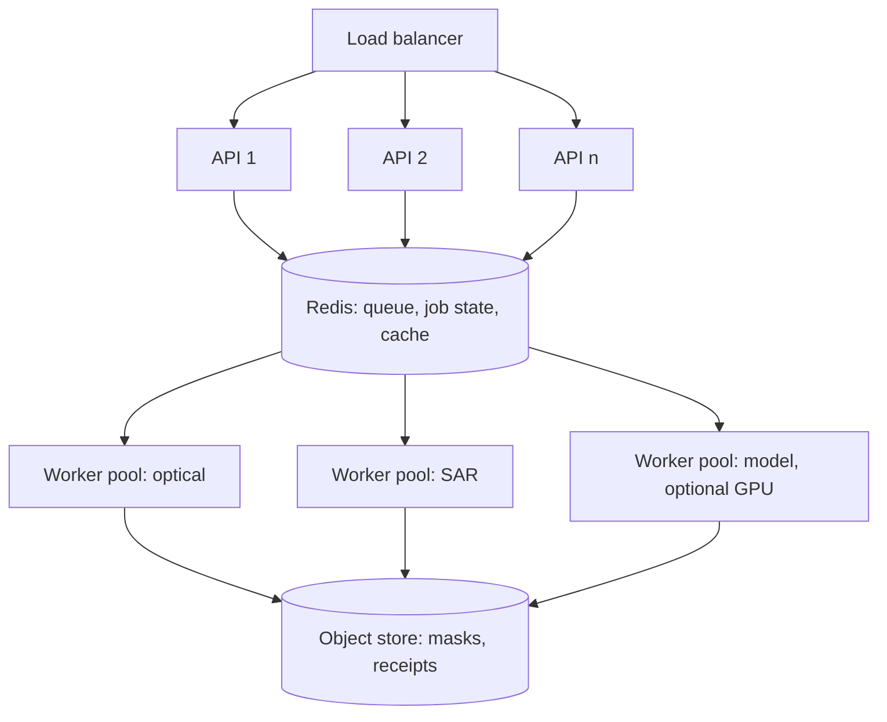
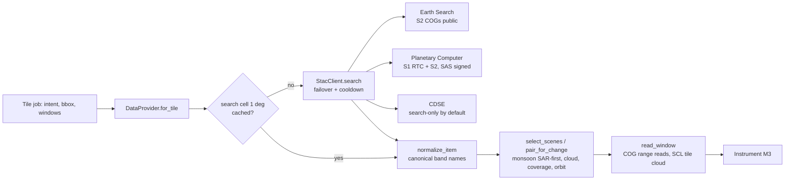
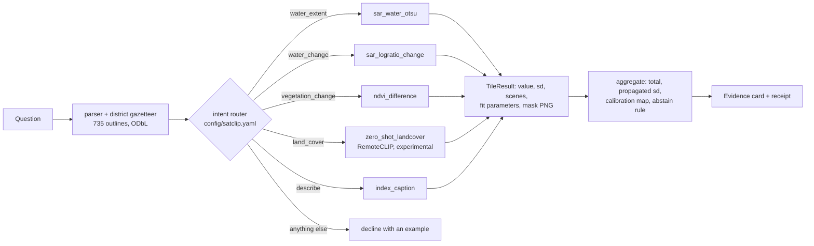
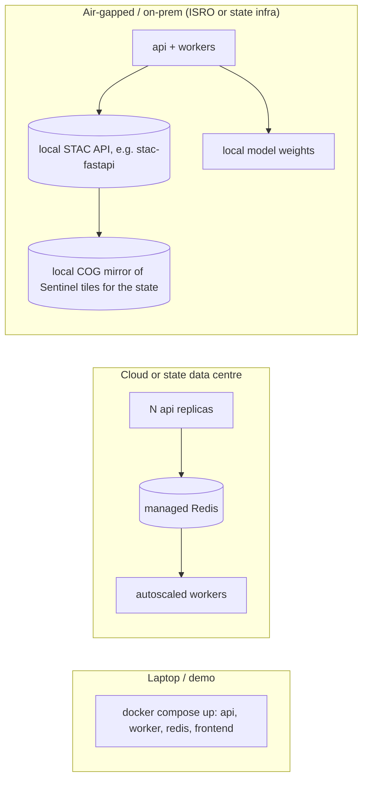

# SatClip architecture

This document describes how SatClip turns a plain-language question into an evidence card, and how the system scales from a laptop to a state data centre. It implements the thesis in [SOLUTION.md](../SOLUTION.md): instruments produce every number, the language layer only parses questions and explains results.

Citation keys: `[A###]` is an archive entry in [archive/papers](../archive/papers/).

---

## 1. Design principles

1. **Stateless API, stateful queue.** Any API replica can serve any request. All job state lives in the queue backend (Redis in production, in-process for development and tests).
2. **The tile is the unit of work.** An area of interest (AOI) is cut into fixed tiles. Each (tile, scene pair, instrument) job is independent, cacheable and retryable, the same idea Earth Engine uses for tile-parallel processing [A047].
3. **Read pixels, never download scenes.** STAC search finds scenes [A050]; Cloud-Optimised GeoTIFF range reads fetch only the AOI window [A049].
4. **Every number has a receipt.** A receipt records the catalogue, collection, STAC Item IDs, asset hrefs, pixel windows, instrument name and version, parameters (including the fitted threshold) and an output hash. Re-running it must give the same hash. This follows the provenance discipline of the Australian data cube [A048].
5. **Abstain by design.** Each instrument returns a calibrated confidence. The aggregator abstains below a published threshold chosen on a risk-coverage curve [A026, A027, A030].
6. **Same containers everywhere.** Laptop, cloud or air-gapped government infrastructure run the same images; only configuration changes.

---

## 2. System overview



| Component | Responsibility | Scales by |
|---|---|---|
| Frontend | Question box, AOI picker, two-date compare, evidence card, map overlay | Static files on any CDN or nginx |
| API | Validate input, parse question, plan tile jobs, stream results, serve receipts | More replicas behind a load balancer |
| Query parser | Text to `ParsedQuery` (intent, AOI, date windows). Rule-based first, LoRA VLM later (M5) | Runs inside the API; small and CPU-bound |
| Job queue | Holds tile jobs and job state; at-least-once delivery | Redis (single node is enough for a state); Redis Cluster beyond |
| Workers | Fetch pixels, run the instrument, calibrate, write tile result and cache entry | More worker containers; each is independent |
| Data layer | STAC search with failover, cloud filter, SAR fallback, COG window reads | Stateless, shares the cache |
| Instruments | Named, versioned, transparent measurement functions with calibration maps | Pure functions; versioned so caches stay valid |
| Aggregator | Combine tile results into one evidence card; decide abstention | Runs in the API when the last tile lands |
| Receipt store | Persist receipts for audit and re-run | Object store or Redis; receipts are small JSON |

---

## 3. Request lifecycle



The parsed query is returned in the first response, so the user sees "I understood your question as ..." before any pixel is read. This catches misread places or dates early (SOLUTION.md risk 3).

---

## 4. Supported query types and the router

The router maps each `ParsedQuery.intent` to exactly one instrument recipe. Short, fixed plans avoid the reliability losses that long tool chains show in EO agents [A024].

| Intent | Example question | Instrument recipe (M3) | Sensor rule |
|---|---|---|---|
| `water_extent` | "How much of Barpeta is under water now?" | Sentinel-1 VV/VH Otsu threshold per tile, permanent water removed [A022, A042, A046] | S1 always in June to September; S2 NDWI when cloud-free |
| `water_change` | "Did flooding spread between 20 June and 5 July?" | Log-ratio change with automatic threshold on same-orbit S1 [A036, A041] | S1, same relative orbit |
| `vegetation_change` | "Did the crop in these blocks decline since sowing?" | NDVI difference or change vector analysis on cloud-masked S2 [A034]; S1 VH time series fallback [A044] | S2 if clear, else S1 |
| `land_cover` | "What is this area mostly?" | RemoteCLIP / GeoRSCLIP zero-shot with temperature calibration [A008, A009, A031] | S2 RGB |
| `describe` | "Describe this scene" | Captioner output labelled as description, no numbers | S2 RGB |
| anything else | "Count the cars", "Will it flood tomorrow?" | Refused with an example of a supported question | none |

---

## 5. Data model



These classes are defined as Pydantic models in [backend/satclip/models.py](../backend/satclip/models.py).

---

## 6. Scalability design

### 6.1 Tiling

- Tiles are fixed squares in a configurable size (default 0.05 degrees, about 5.5 km at Indian latitudes, about 550 x 550 Sentinel pixels at 10 m). A district of 3,000 sq km is roughly 100 tiles.
- Tile IDs are deterministic (`z{size}_{col}_{row}` on a global grid), so two users asking about overlapping AOIs share tiles and cache entries.
- Results stream per tile, so the user sees partial maps within seconds even when the full AOI takes minutes.

### 6.2 Queue and workers

- **Development:** an in-process queue with a thread pool. No external services; tests run in under a second.
- **Production:** Redis lists for jobs and hashes for job state. Workers use blocking pops, acknowledge on completion, and a visibility timeout re-queues jobs from dead workers (at-least-once delivery; tile jobs are idempotent because results are content-addressed).
- **Back-pressure:** per-user and global limits on queued tiles; large AOIs are coarsened (larger tiles, overviews) before being refused.

### 6.3 Caching layers

| Layer | Key | Lifetime | Why |
|---|---|---|---|
| STAC search cache | (catalogue, collection, bbox rounded to tile, date window) | Hours | Search is the slowest network step and changes rarely |
| COG header cache | asset href | Days | Range reads need the header first [A049] |
| Tile result cache | (tile_id, sorted scene IDs, instrument@version, params hash) | Until instrument version changes | Popular districts in flood season are asked about repeatedly |
| Receipt store | receipt_id (hash) | Permanent | Audit and reproducibility |

### 6.4 Horizontal scaling



- API and workers scale independently. During a flood event, scale SAR workers; the API tier barely changes.
- Separate worker pools per instrument family let a GPU pool serve the optional VLM without slowing the CPU instruments.
- A rough capacity model (to be measured in M6): one CPU worker handles one 550 x 550 tile in a few seconds once pixels are local; network reads dominate. Throughput therefore scales with workers until the catalogue rate limit, which is why the search and header caches matter.

### 6.5 Catalogue failover

The data layer tries catalogues in configured priority order (for example Earth Search, then Planetary Computer, then CDSE). A catalogue that times out or rate-limits is skipped for a cool-down period. The receipt records which catalogue served each item, so re-runs use the same source.

### 6.6 Data layer as built (M2, `backend/satclip/data/`)



| Module | Responsibility |
|---|---|
| `scene.py` | `Scene` record; maps each catalogue's band names (`green`, `B03`, `B03_10m`) to canonical names so instruments never see catalogue differences. |
| `stac.py` | STAC API Item Search over httpx, POST with paging via `next` links, per-endpoint cooldown, request-hash cache, per-attempt log for receipts. Endpoints flagged `readable: false` (requester-pays or login-only hrefs) are skipped for pixel work. |
| `select.py` | Sensor order (monsoon water questions go SAR-first; optical-only questions never swap sensors), coverage, readability, band and cloud checks, closest-to-window-centre choice, same-orbit SAR pairs for change. Every decision becomes a plain-language reason on the card. |
| `cog.py` | Windowed reads of a lon/lat box in the raster's own CRS (no resampling of radiometry across projections), GDAL settings for range requests, Planetary Computer SAS signing with token cache, SCL tile cloud fraction. |
| `provider.py` | The single entry point for instruments. Searches once per 1 degree *search cell*, so every tile of a district shares one cached catalogue call. |
| `smoke.py` | `python -m satclip.data.smoke` live check against the public catalogues. |

Known gap: only Planetary Computer serves openly readable Sentinel-1 pixels among the three default catalogues, so SAR has a single readable source unless a CDSE account (or a local mirror) is configured.

### 6.7 AI engine as built (M3, `backend/satclip/instruments/`)



| Instrument | Sensor | Method | Fixed parameters (source) |
|---|---|---|---|
| `sar_water_otsu` | S1 RTC VV (S2 NDWI outside monsoon or as fallback) | Split-based selection of bimodal 1 km blocks (half-overlapping), Kittler-Illingworth minimum-error threshold on the pooled blocks; refit on the 3 x 3 tile neighbourhood at 40 m if the tile alone has no bimodal evidence; speckle blobs under 10 px removed | Ashman D >= 3 on class moments and 3 dB class gap, minority >= 10% (A084, A086); fit above -14 dB gamma0 rejected, default -17 dB gamma0 (A083, shifted +1 dB from sigma0) |
| `sar_logratio_change` | S1 same orbit and track (S2 NDWI pair otherwise) | Water threshold fitted on the after scene and applied to both dates, plus a backscatter drop of at least 3 dB (log-ratio) | 3 dB drop (A036) |
| `ndvi_difference` | S2 pair | NDVI on pixels clear on both dates (SCL 4 to 7), decline where NDVI fell by 0.15 or more on pixels vegetated before (NDVI >= 0.3) | 0.15 drop, 0.3 vegetated |
| `index_caption` | S2 | Shares of water (NDWI > 0), dense vegetation (NDVI >= 0.5), sparse (0.2 to 0.5), other | Index cut-offs |
| `zero_shot_landcover` | S2 true colour | RemoteCLIP ViT-B/32 over 4 x 4 sub-patches, softmax with a calibration temperature | Prompts per class; T = 1.5 placeholder (A031) |

**Confidence model.** Each area instrument estimates how far its area would move if its threshold were wrong by a stated error (1 dB for SAR, 0.05 for NDVI and NDWI). The share of pixels within that error of the threshold gives the area's relative standard deviation `sd_rel = near / (2 x class share)`, and the probability that the area is within plus or minus 20% is `erf(0.2 / (sd_rel x sqrt 2))`. An evidence factor (0.75 to 1.0) discounts default thresholds and cloud. The card's confidence comes from the propagated total: tile standard deviations are summed (full correlation, the conservative case, since tiles share a scene and method). The instrument's calibration file (`config/calibration/`) then maps the score to a probability. Until M5 fits those files on labelled data they are identity maps marked `fitted: false`, and every card prints "placeholder (not yet fitted on labelled data)".

**Region clipping.** A named district is resolved against the gazetteer; only tiles touching the outline are queued, and each instrument rasterises the outline into the scene's own grid so pixels outside the district are never counted.

**Overlays.** Each tile writes a small RGBA PNG reprojected to the tile's lon/lat box (`GET /v1/masks/{name}`), so the map can show exactly which pixels were counted. In docker-compose the `masks` volume is shared by workers and the API.

**Measured on live data (2026-10-05, sandbox CPU, 4 worker threads).** Barpeta district, 11 July 2024 Sentinel-1 pass: 117 tiles, 2,335 sq km measured in 30.6 s end to end, from question to evidence card. A 12-tile box takes 4 to 9 s.

**Defects found on live data and fixed in this milestone.** (1) Otsu placed the threshold at -10.8 dB on a clearly bimodal Barpeta histogram (water mode near -18 dB, land near -7 dB), because land is far more variable than water; Kittler-Illingworth finds the valley near -14 dB. (2) Earth Search Sentinel-2 items carry `earthsearch:boa_offset_applied: true` while `raster:bands` still lists offset -0.1; applying it again made most reflectances negative. (3) A floating-point edge in tiling added a column of tiles outside the requested box.

---

## 7. Deployment modes



- **Laptop:** `docker compose up` starts the full stack. The in-process queue also lets `uvicorn` run alone with no Redis.
- **Cloud:** the same images, Redis managed, workers autoscaled on queue depth.
- **Offline:** point `stac.endpoints` at a local STAC API over a mirrored COG archive for the state, and load model weights from a local path. No call leaves the network. This is the deck's sovereignty goal made concrete.

---

## 8. Configuration

One shared file, [config/satclip.yaml](../config/satclip.yaml), read by the API and workers. Any key can be overridden with an environment variable prefixed `SATCLIP_` (nested keys joined by `__`, for example `SATCLIP_QUEUE__BACKEND=redis`).

| Section | Holds |
|---|---|
| `queue` | backend (`inline` or `redis`), Redis URL, visibility timeout, worker concurrency |
| `tiling` | tile size in degrees, maximum tiles per job |
| `stac` | ordered endpoints with collection names for S1 and S2, timeouts, cool-down |
| `scene` | maximum cloud cover, maximum days from requested date, SAR fallback on or off |
| `trust` | abstention threshold, confidence bands, calibration file paths |
| `intents` | the supported intents and their instrument recipe names |

---

## 9. Repository layout

```
backend/
  satclip/
    api/main.py        FastAPI app: health, queries, jobs, SSE events, receipts
    config.py          settings loader (YAML + env overrides)
    models.py          ParsedQuery, TileJob, TileResult, EvidenceCard, Receipt
    parser.py          rule-based question parser (intent, dates, AOI)
    tiling.py          deterministic global tile grid
    jobqueue.py        inline and Redis queue backends
    worker.py          worker loop: cache, instrument, result
    aggregate.py       tile results to evidence card, abstention
    receipt.py         canonical JSON and output hash
    cache.py           result cache backends
    instruments/       instrument registry (real instruments arrive in M3)
  tests/
  Dockerfile
  pyproject.toml
frontend/              static claymorphism UI (full UX in M4)
config/satclip.yaml    shared configuration
docker-compose.yml     api, worker, redis, frontend
```

---

## 10. What M1 delivers versus later milestones

| Piece | M1 (this milestone) | Later |
|---|---|---|
| API, models, queue, worker loop, tiling, receipts, aggregation | Working, tested, with a placeholder instrument | Done in M3: five real instruments, propagated confidence, overlays (section 6.7) |
| Data layer | Interface and config only | Done in M2: STAC search with failover, cloud filter and SAR fallback, COG reads, search cells (section 6.6) |
| Parser | Rule-based intents, ISO dates, bbox | District gazetteer done in M3 (735 outlines); LoRA VLM parser (M5) |
| Frontend | Claymorphism shell wired to the API | Full UX, map, AOI picker, compare view in M4 |
| Deployment | docker-compose with Redis | Load numbers in M6 |
