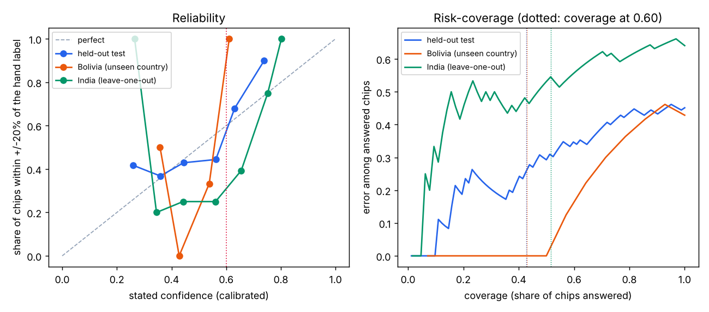

# Calibration report: sar_water_otsu

Generated by `training/calibration/fit_water.py` on 2026-10-07. Dataset: Sen1Floods11 v1.1 hand-labelled chips (archive A022).
Instrument version 1.1 (VV or VH).
Chips used: 408 of 446 (skipped when under half the chip is valid and labelled).
Correct means: +/-20% of max(ref, 0.05 x valid area). Fitted on the train + valid splits (312 chips); sigma0 to gamma0 shift 1.0 dB.

| Evaluation set | Chips | Share correct | ECE before -> after | MCE after | Coverage / error at 0.60, before | Coverage / error at 0.60, after | Median IoU |
|---|---|---|---|---|---|---|---|
| Held-out test split | 82 | 0.55 | 0.139 -> 0.074 | 0.161 | 0.54 / 0.318 | 0.43 / 0.257 | 0.31 |
| Bolivia (country never seen) | 14 | 0.57 | 0.402 -> 0.323 | 0.427 | 0.64 / 0.222 | 0.43 / 0.0 | 0.48 |
| India, fit without India | 64 | 0.36 | 0.295 -> 0.227 | 0.735 | 0.58 / 0.541 | 0.52 / 0.545 | 0.09 |

Chosen map: **logistic** (lower ECE on the valid split when fitted on train only: {'isotonic': 0.1507, 'logistic': 0.1465}). The other map (isotonic) on the same test split, for comparison: ECE 0.116, MCE 0.601, AURC 0.285, coverage 0.24 with error 0.25 at 0.60.

## Card-level check (all chips of an event summed, as the aggregator does for a district)

| Event | Chips | Hand-labelled km2 | Measured km2 | Card confidence | Published | Within 20% |
|---|---|---|---|---|---|---|
| Bolivia | 14 | 43.3 | 31.4 | 0.46 | no | no |
| Ghana | 8 | 6.88 | 3.83 | 0.59 | no | no |
| India | 14 | 71.31 | 57.95 | 0.64 | yes | yes |
| Mekong | 6 | 21.65 | 18.22 | 0.72 | yes | yes |
| Nigeria | 3 | 12.39 | 11.06 | 0.69 | yes | yes |
| Pakistan | 4 | 20.43 | 13.89 | 0.31 | no | no |
| Paraguay | 13 | 20.17 | 22.42 | 0.42 | no | yes |
| Somalia | 6 | 9.41 | 6.28 | 0.24 | no | no |
| Spain | 6 | 37.25 | 27.79 | 0.59 | no | no |
| Sri-Lanka | 8 | 38.09 | 42.39 | 0.70 | yes | yes |
| USA | 14 | 12.39 | 20.45 | 0.29 | no | no |

## v1.0 (VV only, run 6) against v1.1 (VV or VH, run 7)

| Evaluation set | Share correct v1.0 -> v1.1 | ECE after | Coverage at 0.60 | Error when published | Median IoU |
|---|---|---|---|---|---|
| Held-out test split | 0.44 -> 0.55 | 0.088 -> 0.074 | 0.11 -> 0.43 | 0.333 -> 0.257 | 0.15 -> 0.31 |
| Bolivia | 0.29 -> 0.57 | 0.217 -> 0.323 | 0.00 -> 0.43 | None -> 0.0 | 0.18 -> 0.48 |
| India, fit without India | 0.23 -> 0.36 | 0.357 -> 0.227 | 0.12 -> 0.52 | 0.625 -> 0.545 | 0.03 -> 0.09 |

VH bounds were chosen on the train split only (`reports/sar_water_vh_tuning.md`).

Per-chip rows: `sar_water_otsu_chips.csv`. Full numbers: `sar_water_otsu_fit.json`.
